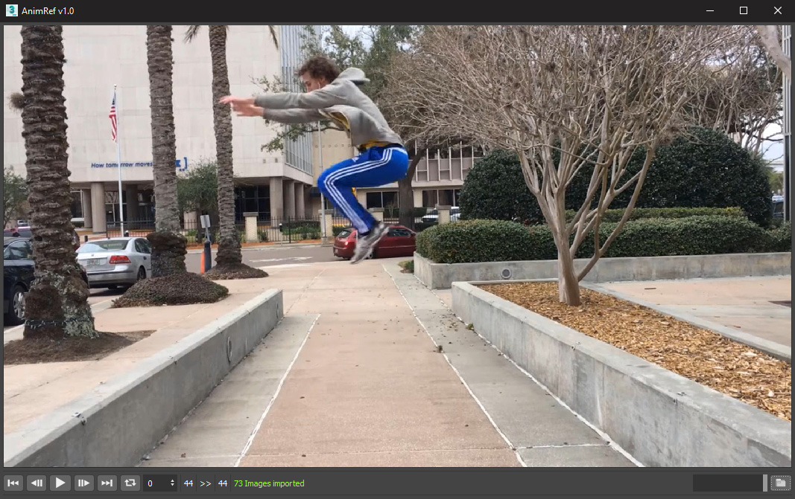

##AnimRef v1.0 - Sequence Loader For 3Ds Max

---
>With AnimRef you can load and play image sequences directly in the 3Ds Max user-interface. There are a few parameters to keep it simple and fast for animators:

###AnimRef v1.0
- Load image Sequences in the desired range
- Time Shift value
- 3Ds Max Synced Time Slider
- Window Opacity Slider
---

| Supported Formats | Description |
| ----------- | ----------- |
| BMP | Windows Bitmap |
| JPG | Joint Photographic Experts Group |
| JPEG | Joint Photographic Experts Group |
| PNG | Portable Network Graphics |
---
