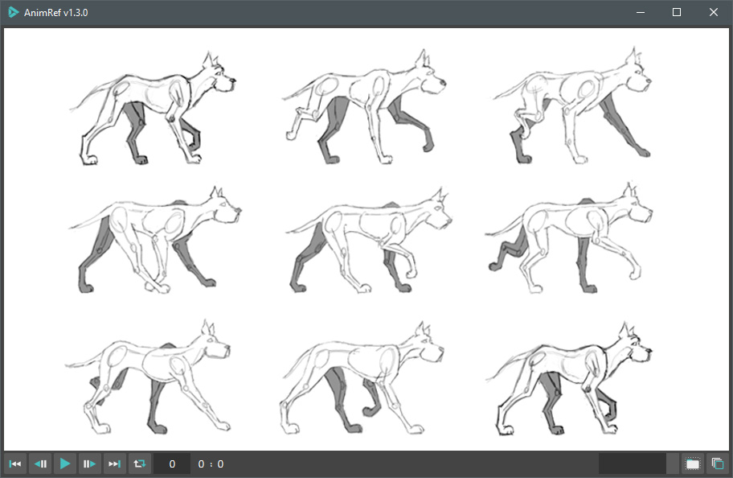

## AnimRef - Sequence Loader For 3Ds Max

---

With AnimRef you can load and play image sequences directly in the 3Ds Max user-interface. There are a few parameters to keep it simple and fast for animators:

---
### AnimRef
- Video to Sequence Converter:

- Viewer Update  
- New UI design
- MessageBox Timer
- Load image sequences in the desired range
- Time shift value
- 3Ds Max synced time slider
- Window opacity slider
---

| Supported Formats | Description |
| ----------- | ----------- |
| BMP | Windows Bitmap |
| JPG | Joint Photographic Experts Group |
| JPEG | Joint Photographic Experts Group |
| PNG | Portable Network Graphics |

>Easy installation: 
	Run "One-Click Installation.bat".
	
>installation: 
	Unzip the "AnimRef.zip" inside "C://ProgramData//Autodesk//ApplicationPlugins".

	
>How To Run: 
	Now, it's a MacroScript, which you can assign a shortcut to it or search it using "X" in 3Ds Max.
	
>Supported Version:

    2018 - 2027
